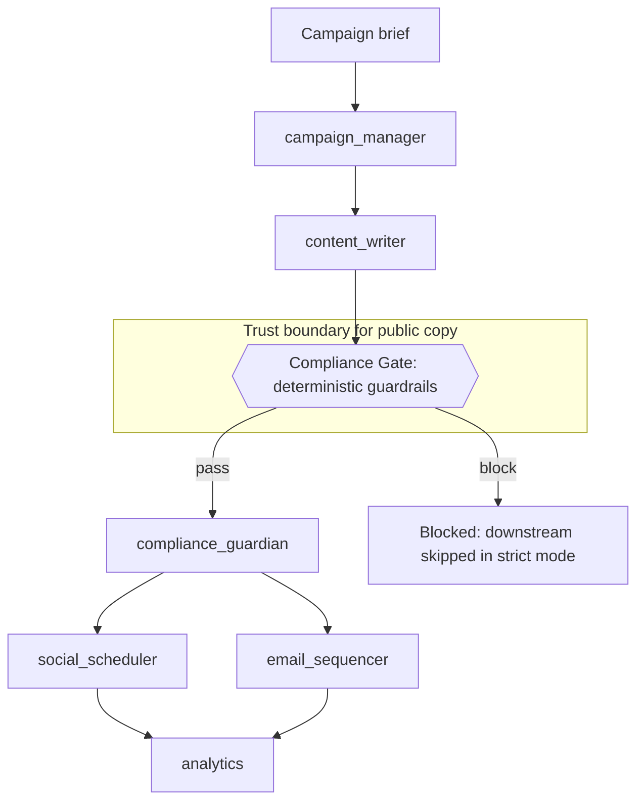

# Thox.ai Campaign Automation

The campaign operations layer for Thox.ai LLC. It generates the campaign
documents as Word files and runs an agent team that drafts, compliance-checks,
schedules, and reports on the campaign. Every content-producing step passes a
deterministic compliance gate before its output is accepted.

This is standalone tooling. It is not device firmware and not the website. It
only references the products as subjects of campaign copy. A human moves cleared
copy into Kickstarter, email, and social tools; this repo does not publish to any
external platform.

## What is here

- `thox_campaign/` - Python package: config loaders, the deterministic guardrail
  engine, weighted prioritization, the LLM clients, the agent team, the DAG
  orchestrator, and the CLI.
- `scripts/` - Node renderer (`docx_lib.js`), content for the six documents
  (`content.js`), the driver (`generate_docs.js`), and a Python verifier
  (`verify_docs.py`).
- `config/` - `brand_guardrails.yaml`, `campaign.yaml`, `agents.yaml`.
- `prompts/` - one system prompt per agent.
- `tests/` - pytest suite for the guardrails, prioritization, and orchestrator.
- `docs/` - generated Word documents (created at runtime).

## Quickstart

```bash
# Python package and tests
pip install -e ".[dev]"
pytest

# Scan copy against the compliance gate
python -m thox_campaign.cli scan --text "Data stays on your devices."   # passes
python -m thox_campaign.cli scan --text "Patent Pending, 100 TOPS"       # exits 1

# Run the agent DAG offline (mock LLM). Use --live with ANTHROPIC_API_KEY set.
python -m thox_campaign.cli run "Launch day brief" --show-output

# Score and rank options
python -m thox_campaign.cli prioritize --json \
  '[{"name":"Founder Reservation","market":9,"technical":8,"time_to_market":9,"strategic":8},
    {"name":"Kickstarter first","market":7,"technical":6,"time_to_market":5,"strategic":9}]'

# Generate the six documents
npm install
node scripts/generate_docs.js          # or: python -m thox_campaign.cli generate-docs
python scripts/verify_docs.py           # re-scan generated docs through the gate
```

## Architecture

The team is a fixed DAG. The content writer's output passes through a
deterministic compliance gate before anything downstream runs. The gate is the
trust boundary for public copy: on a block, downstream agents are skipped in
strict mode.



The same `GuardrailEngine` that gates agent output also verifies the generated
documents (`scripts/verify_docs.py`), so Node-rendered copy is held to the exact
same rules as agent-drafted copy.

## Regenerating the documents

`node scripts/generate_docs.js` renders all six documents into `docs/` and prints
each file's byte size. It exits nonzero on any failure. The six documents are:

1. `campaign-story.docx` - narrative, the five-SKU family, how devices work
   together, founders, manufacturing, and the ask across both phases.
2. `faq.docx` - privacy, devices, ownership, colorways, delivery, refunds, support.
3. `email-sequences.docx` - pre-launch, launch day, nurture, final 48 hours, onboarding.
4. `social-media-calendar.docx` - pre-launch runway plus a 30-day weekly plan.
5. `press-release.docx` - headline, lineup, availability and pricing, quotes, about.
6. `kickstarter-runbook.docx` - internal operations playbook (kind: internal).

The logo is embedded above the hero band of each document if
`assets/THOX_ai_Logo_Horiz.png` is present; if it is absent, the renderer warns
and continues.

### Visual design

Each document opens with an emerald hero band (title reversed out in white over
`#0B6E4F`) and a thin emerald accent rule. The renderer (`scripts/docx_lib.js`)
provides design blocks beyond plain prose, all built from color, shading, and
borders so no emoji or em dash is ever emitted:

- `hero` (automatic from `title` / `subtitle` / `eyebrow`), `banner` section dividers.
- `stats` tiles (big emerald figure over a muted label) and `cards` grids
  (tag, title, body) for the device family and the founders.
- `quote` pull quotes with a heavy emerald spine, `callout` boxes, and `kicker`
  eyebrow labels.
- `table` with emerald-dark uppercase headers and zebra-striped rows.

To review the design in a browser without Word, run `node scripts/preview_html.js`.
It renders the same content specs into self-contained HTML at `docs/preview/`
(open `all.html` for the full gallery). The HTML mirrors the `.docx` output and is
generated, not committed.

## Open items

- **Wordmark casing.** This repo defaults to `Thox.ai` (mixed case). The live site
  uses `THOX.ai`. The casing is an open branding decision; the default here is the
  conservative, readable choice.
- **ThoxMini vs ThoxOnStick boundary.** ThoxMini is the USB-C private Linux compute
  stick (matches the live site). ThoxOnStick is a distinct bootable-ThoxOS
  environment appliance that runs a self-contained ThoxOS desktop on a host
  machine. This product boundary is the single open product decision and should be
  confirmed before the Kickstarter phase.
- **Non-Nova pricing.** ThoxNova pricing is locked. The other four SKU prices are
  working figures pending sign-off and are kept out of public copy until then.
- **MagStack trademark superscript.** The required-style note to render a trademark
  superscript on the first MagStack mention per page is a cosmetic refinement not
  yet implemented in the plain-text block model; copy uses "MagStack" as written.

## Assumptions

1. Build both go-to-market models in one repo, sequenced: the Founder Reservation
   is the primary, live-aligned phase (Nova-only refundable deposit); the
   Kickstarter is phase two and carries all five SKUs.
2. All five SKUs ship in the lineup, with the ThoxMini vs ThoxOnStick boundary
   resolved as above.
3. Claims hold the conservative line: the gate forbids regulatory and hardware
   claims even though the public website currently uses some of them.
