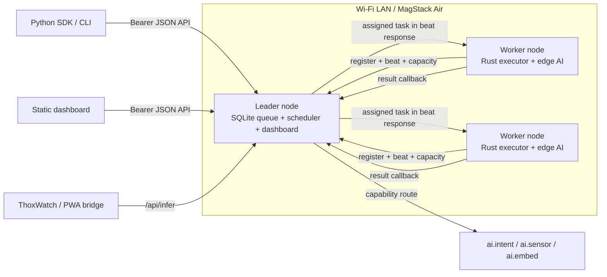

# MagStack Air Edge RS

Rust-first MagStack Air prototype for ThoxMini Air / ThoxOS Air-class edge devices.

This package improves the previous MagStack Air direction by turning the Wi-Fi cluster from a generic task fabric into a realistic edge-AI vertical slice:

- Rust controller/worker node runtime.
- SQLite-backed leader queue instead of in-memory job state.
- Real local inference tasks that run without cloud calls or heavy LLM assumptions.
- Capability-routed scheduling for AI jobs.
- Token-authenticated HTTP API.
- HMAC helpers for internal message signing.
- Python SDK for product and demo workflows only.
- Static dashboard for local LAN demo use.
- Raspberry Pi deployment scripts and systemd units.
- Root docs: `ecosystem_map.md`, `mvp_catalog.md`, and `development_queue.md`.

The built-in edge-AI workloads are intentionally Pi Zero 2 W realistic:

| Task kind | Runtime | Description |
|---|---|---|
| `ai.intent.v1` | Rust | Tiny bag-of-words softmax classifier for prompt routing and local intent detection. |
| `ai.sensor_anomaly.v1` | Rust | Lightweight z-score anomaly detector for thermal, power, motion, or simple telemetry vectors. |
| `ai.embed_hash.v1` | Rust | Deterministic hashed text vector for local routing, dedupe, and cache keys. |
| `plugin.process.v1` | Rust-supervised external process | Optional allowlisted bridge for ONNX/TFLite/llama.cpp wrappers on bigger nodes. Disabled unless configured. |

This is not positioned as a large local LLM runtime for a Pi Zero 2 W. It is a working prototype for edge dispatch, lightweight inference, AI routing, telemetry, and cluster job coordination. Bigger Thox nodes can advertise additional capabilities and receive heavier tasks through the same protocol.

## Architecture



## Quick start: local dev demo

The sandbox used to generate this package did not include the Rust toolchain, so the Rust code was generated and statically inspected here, but must be compiled in a Rust environment.

```bash
cargo test --workspace
cargo build --release
```

Run one process as a leader plus local worker:

```bash
export MAGSTACK_AIR_TOKEN='change-this-token'
export MAGSTACK_AIR_INTERNAL_SECRET='change-this-internal-secret'

./target/release/magair-node \
  --mode standalone \
  --bind 127.0.0.1:8787 \
  --db ./state/magstack-air.sqlite \
  --models-dir ./models \
  --token "$MAGSTACK_AIR_TOKEN" \
  --internal-secret "$MAGSTACK_AIR_INTERNAL_SECRET"
```

Submit a real inference job:

```bash
./target/release/magairctl infer \
  --url http://127.0.0.1:8787 \
  --token "$MAGSTACK_AIR_TOKEN" \
  --kind ai.intent.v1 \
  --text 'check cluster temperature and summarize battery health'
```

Submit a sensor anomaly job:

```bash
./target/release/magairctl submit \
  --url http://127.0.0.1:8787 \
  --token "$MAGSTACK_AIR_TOKEN" \
  --kind ai.sensor_anomaly.v1 \
  --payload '{"features":[54.2,0.71,0.12]}' \
  --capability ai.sensor_anomaly.v1
```

## Multi-node Pi Zero 2 W deployment

Build on an ARM64 machine or cross-compile:

```bash
rustup target add aarch64-unknown-linux-gnu
cargo build --release --target aarch64-unknown-linux-gnu
```

Copy `target/aarch64-unknown-linux-gnu/release/magair-node` and `magairctl` to each Pi.

Leader Pi:

```bash
sudo install -m 0755 target/aarch64-unknown-linux-gnu/release/magair-node /usr/local/bin/magair-node
sudo install -m 0755 target/aarch64-unknown-linux-gnu/release/magairctl /usr/local/bin/magairctl
sudo mkdir -p /etc/magstack-air /var/lib/magstack-air /opt/magstack-air/models
sudo cp models/*.json /opt/magstack-air/models/
sudo cp configs/leader.env.example /etc/magstack-air/air.env
sudo cp systemd/magstack-air-node.service /etc/systemd/system/
sudo systemctl daemon-reload
sudo systemctl enable --now magstack-air-node
```

Worker Pi:

```bash
sudo install -m 0755 target/aarch64-unknown-linux-gnu/release/magair-node /usr/local/bin/magair-node
sudo mkdir -p /etc/magstack-air /var/lib/magstack-air /opt/magstack-air/models
sudo cp models/*.json /opt/magstack-air/models/
sudo cp configs/worker.env.example /etc/magstack-air/air.env
sudo sed -i 's|MAGSTACK_AIR_LEADER_URL=.*|MAGSTACK_AIR_LEADER_URL=http://<leader-ip>:8787|' /etc/magstack-air/air.env
sudo systemctl daemon-reload
sudo systemctl enable --now magstack-air-node
```

## API shape

| Endpoint | Purpose |
|---|---|
| `GET /health` | Open process health. |
| `GET /api/status` | Authenticated node/leader status. |
| `GET /api/nodes` | Registered workers and capabilities. |
| `GET /api/tasks` | Task history. |
| `POST /api/tasks` | Submit capability-routed task. |
| `POST /api/infer` | Submit sync/async inference request. |
| `POST /internal/register` | Worker registration. |
| `POST /internal/beat` | Worker heartbeat plus pull assignment. |
| `POST /internal/result` | Worker result callback. |

## What improved over Claude's described package

Claude's package moved in the right direction by choosing Rust, zero-config-ish fabric, guardrails, a Python SDK, and a dashboard. This package improves the prototype in five critical places:

1. **Real edge AI**: built-in Rust inference tasks are included, not just task execution plumbing.
2. **Durable queue**: leader state persists in SQLite so demos survive process restarts.
3. **Capability routing**: nodes advertise `ai.intent.v1`, `ai.sensor_anomaly.v1`, `ai.embed_hash.v1`, and optional plugin capabilities.
4. **Failure recovery**: stale running jobs are requeued after timeout.
5. **ThoxOS Air alignment**: docs and API structure match the hardened embedded Linux direction, while leaving large-model work to bigger Thox nodes.

## Validation

Generated in this environment:

```text
- Repository tree generated.
- Python SDK unit tests passed.
- JSON model files validated.
- Shell scripts passed bash -n.
- Node dashboard JavaScript parsed with node --check via extracted script.
- Rust source statically scanned for common syntax sentinels.
```

Not completed in this environment:

```text
- cargo test / cargo build, because rustc/cargo were not installed in the sandbox.
- Hardware Wi-Fi tests on Pi Zero 2 W fleet.
- mDNS discovery validation; explicit leader URL is the default for reliable P0 bring-up.
```

## Repository map

```text
crates/
  magair-core/       Shared protocol, auth, metrics, AI models, SQLite store
  magair-node/       Leader/worker/standalone runtime
  magair-ctl/        CLI
sdk/python/          Dependency-light Python SDK
dashboard/static/    Local dashboard
models/              Tiny edge-AI model JSON
configs/             Env examples
systemd/             systemd unit
scripts/             Build/install/run helpers
docs/                Operations, security, API, AI jobs, Claude review
```

## Device showcase HTML

Open `showcase.html` or `docs/device_showcase.html` for a standalone internal showcase page that presents the MagStack Air / ThoxMini Air device, Rust Wi-Fi fabric, and realistic edge-AI job demo flow.
