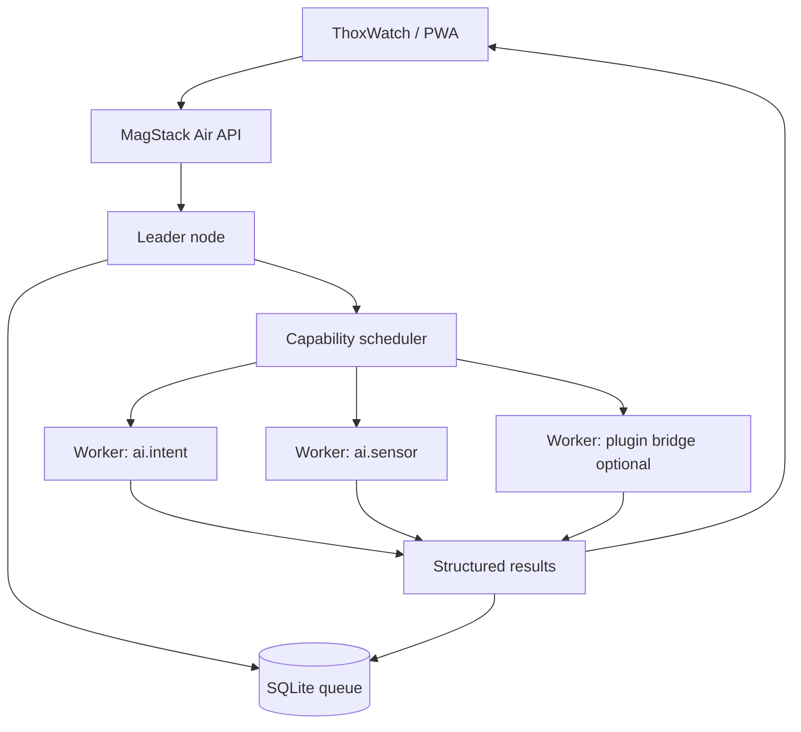

# ecosystem_map.md - MagStack Air Edge RS

## Module

`MagStack Air Edge RS` is the Rust-first Wi-Fi cluster and edge-AI runtime for ThoxMini Air / ThoxOS Air-class nodes.

It sits between the hardware enclosure/platform work and the broader ThoxOS / MeshStack software family.

## Parent ecosystem

```text
THOX.ai edge AI portfolio
├── ThoxOS / ThoxOS Air
├── MeshStack private device cooperation
├── MagStack physical device coupling
├── ThoxWatch / PWA dispatch surfaces
├── ThoxMini / ThoxAir / ThoxNova device families
└── MagStack Air Edge RS runtime
```

## Upstream dependencies

```text
- Raspberry Pi Zero 2 W class Linux node
- Wi-Fi LAN, usually 2.4 GHz on Pi Zero 2 W
- Rust runtime binaries: magair-node, magairctl
- Tiny JSON edge-AI models in /opt/magstack-air/models
- Optional local gateway/PWA/watch dispatch surface
- systemd for service supervision
- SQLite on leader for queue persistence
```

## Downstream consumers

```text
- ThoxWatch Air screen and PWA Air/AI control panel
- Local AI demo workflows
- Edge telemetry and anomaly jobs
- Future MeshStack routing bridge
- Future ThoxOS Air image builder
- Future NPU-capable Air/Clip/Nova nodes
```

## Boundaries

```text
MagStack Air Edge RS owns:
  - node registration
  - heartbeat/capacity reporting
  - task queue
  - capability routing
  - small-model inference
  - worker result reporting
  - local dashboard/API

It does not own:
  - production secure boot implementation
  - battery pack hardware design
  - Pi Zero 2 W claiming large LLM capability
  - mobile native app store release path
  - public campaign copy
```

## Connection diagram


