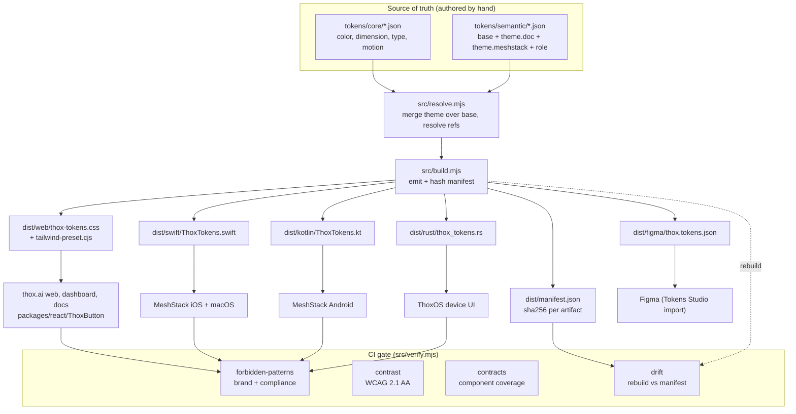
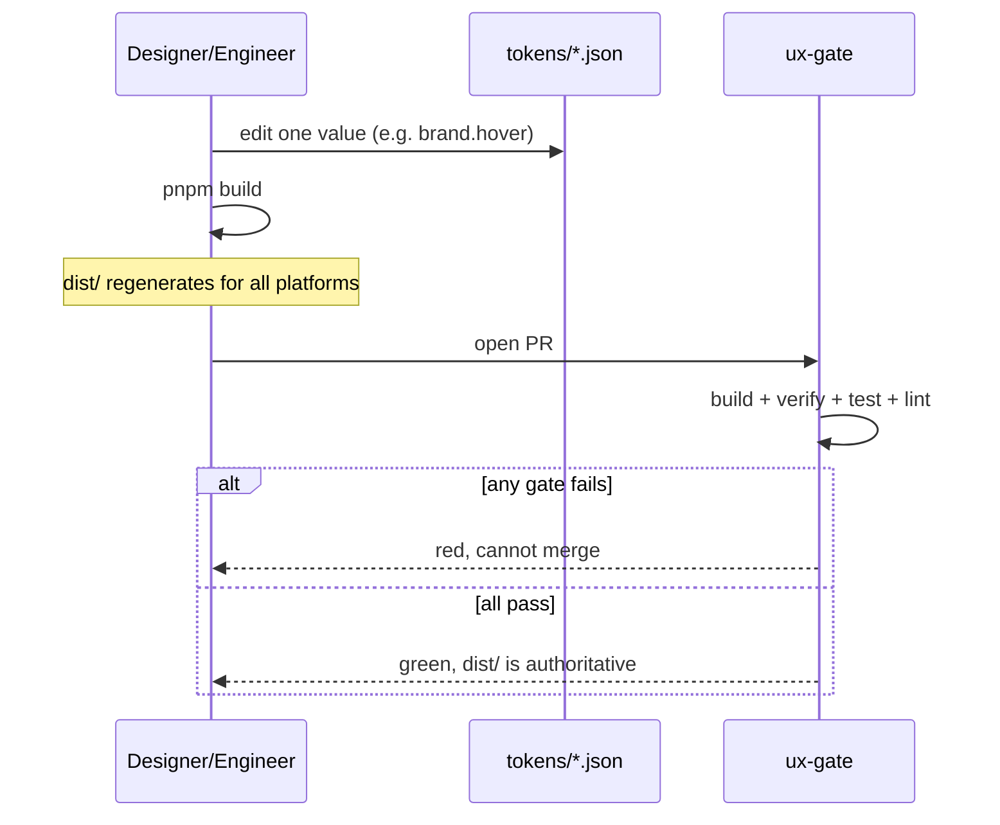
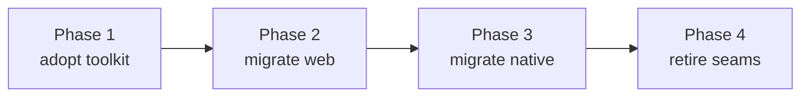

# THOX UX Standardization Mechanism

<!-- thox-lint:disable-file (governance doc: quotes the forbidden terms it documents) -->


`@thox/txf-ux-engine` is the single source of truth for how every THOX surface looks and
behaves. One token tree compiles to every platform, and four CI gates make
divergence impossible to merge. This replaces the two parallel systems that
were drifting apart: the `thox-brand` skill (which governed web, docs, and
decks) and the MeshStack blueprint pack (which governed the four native apps).

## Problem this solves

Before this toolkit there were two structural failures:

1. Two sources of truth. Brand values lived in a skill; app tokens lived in a
   separate JSON seed; nothing reconciled them. A change in one did not reach
   the other.
2. No compiled enforcement. The token JSON existed but nothing consumed it.
   Every platform file (CSS, Swift, Kotlin, docs) was hand-maintained, so the
   tokens and the code that used them drifted on every edit. The recurring
   manual drift audits were the symptom.

The fix is to make the tokens the only place a value is authored, compile them
to every platform mechanically, and fail the build when any artifact or any
file drifts from that source.

## Architecture



## The four gates

| Gate | Module | Blocks | How |
| --- | --- | --- | --- |
| Forbidden patterns | `src/lint/forbidden.mjs` | Off-brand color, banned claims, leaked restricted facts | 14 rules, surface-scoped (public/internal/magstack) |
| Contrast | `src/lint/contrast.mjs` | Any text or UI pair below WCAG AA | Relative-luminance ratio per theme, interactive vs document pair sets |
| Contracts | `src/lint/contracts.mjs` | A component missing states, tokens, or platforms | Validates `contracts/*.contract.json` against schema and resolved tokens |
| Drift | `src/lint/drift.mjs` | Hand-edited platform output | Rebuilds in memory, sha256-compares to `dist/manifest.json` |

`src/verify.mjs` runs all four and exits non-zero on any failure. The CI
workflow `.github/workflows/ux-gate.yml` runs build then verify then tests then
the repo-wide forbidden scan on every PR that touches UX.

### Surface scoping

The forbidden-pattern gate is strictest on public Founders content. A file
declares its surface by path or by a directive comment:

```
// thox:surface=public     strictest: no SoC names, TOPS, algorithm names,
//                          partner identity, restricted SKUs, banned claims
// thox:surface=internal    brand color + claim rules still apply
// thox:surface=magstack     purple is allowed here and only here
```

Purple (`#a855f7` / `#c084fc`) is rejected everywhere except `magstack` surfaces.
`gray-*` Tailwind classes are rejected in favor of `zinc-*`. Cyan is rejected
globally. `tok/s` numbers without a measured-and-dated annotation warn.

## Token change workflow



A value is edited in exactly one place: `tokens/`. Never in `dist/`, never in a
platform file. `pnpm build` regenerates every artifact. The drift gate then
guarantees the committed `dist/` matches the token source.

## How each platform consumes the output

| Platform | Artifact | Consumption |
| --- | --- | --- |
| Web (Next.js 14) | `dist/web/thox-tokens.css`, `tailwind-preset.cjs` | Import the CSS once at root; add the preset to `tailwind.config`. Set `data-theme` on a wrapper to switch base/meshstack/doc. |
| React primitives | `packages/react/ThoxButton.tsx` | Bind only to the generated CSS vars. One canonical button across all web surfaces. |
| iOS + macOS | `dist/swift/ThoxTokens.swift` | Vend `Color` and dimension constants via a `ThoxButtonStyle`. |
| Android | `dist/kotlin/ThoxTokens.kt` | `Color(0xAARRGGBB)` and `Dp` constants for Compose. |
| ThoxOS device UI | `dist/rust/thox_tokens.rs` | `&str` hex and `u32` RGBA consts for the device renderer. |
| Figma | `dist/figma/thox.tokens.json` | Import via Tokens Studio; one set per theme. Designers pull, never invent. |

## Themes

| Theme | Tokens | Surface | Notes |
| --- | --- | --- | --- |
| base | 126 | App dark (default) | Emerald on zinc-950 |
| meshstack | 127 | MeshStack app | Cooler near-black overlay |
| doc | 126 | Word/PDF, light pages | Light flip; accent is emerald-800 for AA on white |

`text.accent` exists specifically because emerald-500 fails AA on a white
document surface. The doc theme rebinds it to emerald-800 (7.68:1 on white),
and the contrast gate enforces document pairs separately from interactive pairs.

## Component contracts

A contract is the platform-agnostic definition of a component: its variants,
states, token bindings, accessibility requirements, target platforms, the user
journeys it serves, and a readiness level (L0 concept to L5 shipped everywhere).

| Contract | Readiness | Kind | Journeys |
| --- | --- | --- | --- |
| MS / Action / PrimaryButton | L3 | interactive | J-001, J-002, J-006 |
| MS / Cards / DeviceCard | L3 | interactive | J-004, J-005, J-009 |
| MS / Status / MeshStatusPill | L2 | static | J-003, J-005 |
| MS / Pairing / QRPairingCard | L2 | interactive | J-002, J-003 |

Interactive contracts must declare default, pressed, disabled, loading, plus
focus or hover, and `focusVisible: true`. The contracts gate fails if a token
binding does not resolve or a platform mapping is missing.

## Governance and ownership

- Source of truth: `tokens/` owned by the design-system owner (CTO sign-off on
  brand-level changes: brand color, device role labels, forbidden lists).
- Contracts: owned jointly by design and the platform leads who implement them.
- Gates: owned by the toolkit. Rules are added in `src/lint/` with a test in
  `test/` and a fixture in `samples/`.
- No platform team edits `dist/`. The drift gate enforces this mechanically.

## Migration plan (retire the two parallel systems)



1. Phase 1. Land `@thox/txf-ux-engine` with the four gates wired into CI. Tokens here
   become canonical. The `thox-brand` skill becomes a pointer to this package.
2. Phase 2. Repoint thox.ai web, dashboard, and docs at `dist/web`. Replace
   ad hoc buttons with `ThoxButton`. Delete local color literals.
3. Phase 3. Repoint MeshStack iOS, Android, macOS, Windows at the Swift, Kotlin,
   and equivalent emitted constants. Fold `design_tokens.meshstack.json` into
   `tokens/semantic/theme.meshstack.json` (already done here) and delete the
   standalone seed.
4. Phase 4. Remove the manual drift-audit doc and the duplicate brand color
   tables from the blueprint pack. The gate now does that job on every PR.
