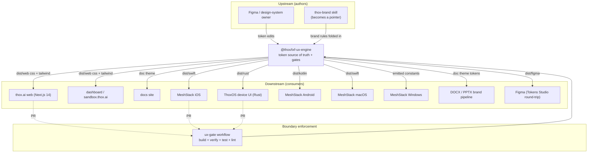

# ecosystem_map.md

Where `@thox/txf-ux-engine` sits and what it connects to.

## Parent product

THOX.ai platform. `@thox/txf-ux-engine` is shared infrastructure, not a product surface.
It defines the visual and behavioral contract every product surface honors.

## Upstream dependencies

- Figma and the design-system owner author token values.
- The `thox-brand` skill supplies brand rules and forbidden lists; those are
  folded into `tokens/` and `src/lint/forbidden.mjs`, after which the skill
  becomes a pointer to this package.
- No runtime code dependencies. Pure Node ESM, zero npm dependencies, so it
  builds and self-verifies anywhere.

## Downstream consumers

- thox.ai web, dashboard, sandbox, docs (CSS vars plus Tailwind preset).
- React primitives in `packages/react` (canonical `ThoxButton`).
- MeshStack iOS, macOS (Swift), Android (Kotlin), Windows (emitted constants).
- ThoxOS device UI (Rust constants).
- DOCX and PPTX brand pipeline (doc theme tokens).
- Figma round-trip (Tokens Studio set per theme).

## Data boundaries

- Inbound: token JSON only. Authored in `tokens/`, nowhere else.
- Outbound: generated artifacts in `dist/`, never hand-edited.
- Enforcement: the drift gate rebuilds and sha256-compares to
  `dist/manifest.json`; the forbidden, contrast, and contract gates block bad
  content at the PR boundary.
- The toolkit holds no secrets, no user data, no network calls.

## Connects to existing THOX assets

- `cross_platform_app_blueprint.md`, `user_journeys_by_platform.md` (J-001..J-010):
  contracts reference these journeys.
- `component_inventory.md`: readiness levels L0..L5 map to the `readiness` field
  on each contract.
- `design_tokens.meshstack.json`: superseded by
  `tokens/semantic/theme.meshstack.json` here.
