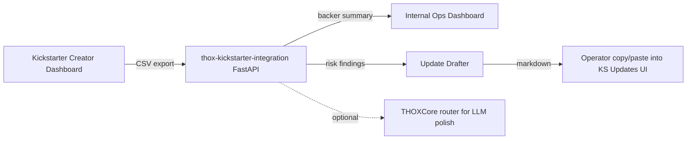

# Kickstarter Ops Integration

This doc describes how `ttracx/thox-kickstarter-integration` is used to run
the live Kickstarter campaign and the fulfillment months that follow. It
covers what the integration does, where it deploys, who has access, the
data flow back into the operator dashboard, and the gates that must pass
before launch day clicks live.

This repo (`thox-kickstarter`) is the launch PLAYBOOK. The integration is
the operational data plane. The two compose; they do not overlap.

## What the integration does

- Ingest creator exports from the Kickstarter creator dashboard:
  - backer report CSV
  - referral tag CSV
  - advanced creator dashboard CSV (pledge breakdown, daily revenue)
- Normalize the rows into a queryable surface (SQLite default, Postgres
  profile available)
- Expose a fulfillment-risk endpoint that flags backers most likely to
  trigger a refund, an address change, or a shipping issue
- Draft backer updates as markdown from a risk profile or a milestone
  event, ready for the operator to paste into the Kickstarter Updates UI
- Hold a locked partner-API adapter that activates only if Kickstarter
  grants official creator API credentials; off by default

## When it runs

- **Launch day (Aug 12 2026)**: smoke-tested and deployed BEFORE the click-launch moment so the first backer-report import can run within minutes of the first pledges
- **Live campaign (Aug 12 to Sep 11)**: ingestion + fulfillment-risk + update-drafter run on operator demand; no public-facing endpoints
- **Fulfillment (Nov 2026 onward)**: address-collection, shipping-issue triage, refund flagging continue through the fulfillment window

## Where it deploys

- Small FastAPI process on a `t-build-01`-class node or a $5/month VPS
- No inbound from the public internet; only reachable behind Tailscale or a VPN
- Dashboard is internal only; operator surface only
- SQLite in `data/ks_ops.sqlite` by default; Postgres optional via env

## Who has access

- **dev@thox.ai** (the Kickstarter account identity that has collaborator on the campaign)
- **operator role** (Tommy + Craig per IP-033 inventors)
- **fulfillment analyst** (TBD; placeholder seat for the fulfillment-window staffer)

PII masking is on by default on backer-list endpoints. Full reveal is gated
on an `X-Operator-Token` header that only the operator role holds.

## Data flow

The dotted edge to `thoxcore` is optional. The integration runs deterministic
risk rules without any LLM. The router is wired in only if the operator
asks for a polished update draft instead of a structured markdown skeleton.

## Launch-day gates

These six gates MUST clear before the launch button is clicked at 9:00am PT
on Aug 12 2026. Owner is Tommy unless noted.

- [ ] **Integration deployed on the ops VPS** (Tailscale-only reachable, FastAPI healthcheck passes)
- [ ] **dev@thox.ai added as Kickstarter collaborator** with Analytics + Coordinate fulfillment + Manage community per the integration's runbook
- [ ] **First backer-report import smoke-tested** and the row counts match the Kickstarter dashboard totals
- [ ] **Fulfillment-risk endpoint returns valid output** on a test campaign profile
- [ ] **PII masking verified** on at least one backer-list endpoint (default-mask + X-Operator-Token reveal both confirmed)
- [ ] **Update-drafter produces sane markdown** for a synthetic risk profile (no hallucinated backer names, no leaked emails)

If any gate fails at T-1, the integration is held back and operations runs
manually for the first 48 hours; launch is not blocked.

## Risk register

| Risk | Mitigation |
|---|---|
| Data loss in `data/ks_ops.sqlite` | CSV re-import is idempotent; raw exports retained in `data/raw/` for replay |
| PII exposure to a non-operator viewer | Masking default on every backer-list endpoint; full reveal gated on `X-Operator-Token`; no public surface |
| Kickstarter ToS drift | Integration never scrapes; runbook references the official creator support pages; partner-API adapter is locked and dark by default |
| dev@thox.ai role loss | Tommy has a fallback admin seat; collaborator add is documented in the integration runbook with screenshots |
| Update-drafter hallucinates a backer name | All drafts are skeletons with placeholders; operator must paste real backer data; the drafter never auto-publishes |

## Migration to partner API

If Kickstarter grants official creator API credentials in the future, the
locked adapter can be enabled via env. The integration runbook covers:

- Setting `KS_PARTNER_API_ENABLED=true`
- Loading the credentials from the operator vault (NOT committed; NOT in env files; in the operator's local secrets store)
- Flipping the ingestion path from CSV to API on a per-endpoint basis (granular cutover, not a big-bang switch)
- Falling back to CSV ingestion when the partner API rate-limits

Until that day, CSV ingestion is the only path and the partner-API adapter
stays dark.
