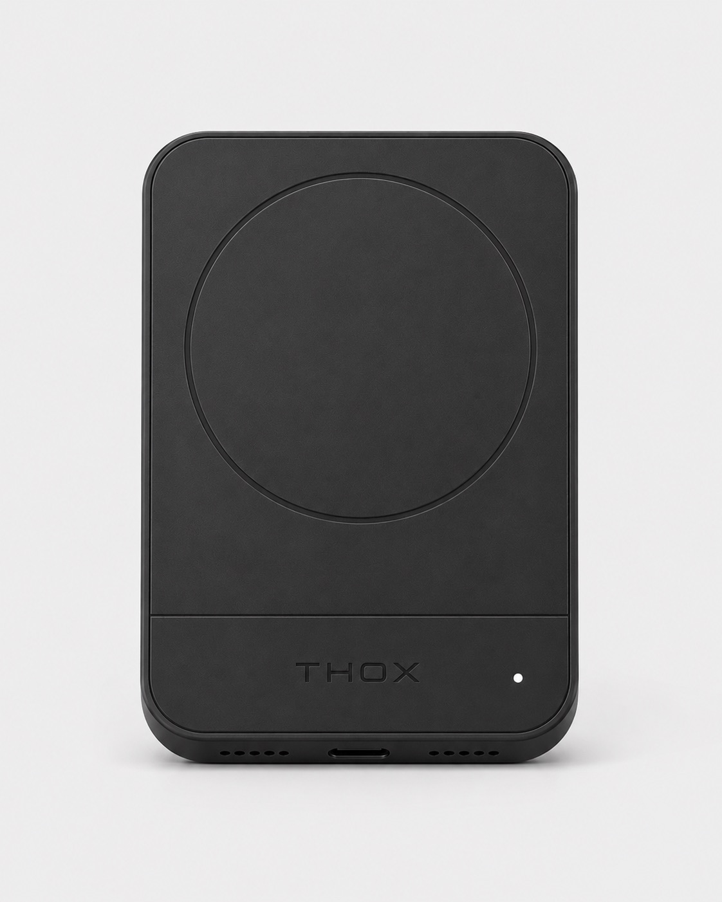

# ThoxClip — Spec Sheet (v2)

> Pocket-class private AI compute node. Smallest member of the THOX device fleet.

---

## Overview

ThoxClip is a Raspberry Pi Zero 2 W inside a THOX brand enclosure, running the
THOX runtime and thoxymicro agent. It boots as a USB-Ethernet device, giving you
a private LAN with the clip on the other end — an offline chat agent and skill
runner that never leaves your physical possession.

| Field | Value |
|---|---|
| **Product class** | Pocket compute node |
| **Target user** | Individual developer, researcher, privacy-first user |
| **Price** | See [Rewards Matrix](../../../docs/REWARDS_MATRIX.md) |
| **Launch** | August 2026 (Kickstarter) |
| **Status** | GO — shipping ready |

---

## Hardware

| Specification | Value |
|---|---|
| **SoC** | Raspberry Pi Zero 2 W (Broadcom BCM2837A1) |
| **CPU** | 1 GHz quad-core ARM Cortex-A53 (64-bit) |
| **RAM** | 512 MB LPDDR2 SDRAM |
| **Wireless** | 2.4 GHz 802.11n Wi-Fi, Bluetooth 4.2 BLE |
| **NPU** | None (CPU inference) |
| **Storage** | microSD card (pre-flashed, 16 GB minimum) |
| **USB** | 1x micro-USB OTG (data + power), 1x micro-USB (power only) |
| **Power** | 5 V / 1.5 A via micro-USB |
| **Enclosure** | THOX brand enclosure, matte black / arctic white / space gray |
| **Dimensions** | 65 mm × 30 mm × 14 mm (enclosure) |
| **Weight** | ~17 g (board) + enclosure |
| **Operating temp** | 0 °C to 70 °C |
| **Cooling** | Passive (no fan) |

---

## Software

| Specification | Value |
|---|---|
| **OS** | Raspberry Pi OS Lite (64-bit), Linux 6.6 LTS |
| **Agent** | thoxymicro (Go, Apache-2.0) |
| **Runtime** | THOX runtime with 14 pre-installed skills |
| **Default model** | ThoxMicro-125M (Apache-2.0) |
| **Alternative models** | ThoxLLM-327M-v2, ThoxGem-E4B (Q4_K_M) |
| **Inference engine** | llama.cpp (MIT) |
| **Networking** | USB-Ethernet gadget, Tailscale (optional) |
| **Web UI** | `http://thoxclip.local` or `http://192.168.7.1` |
| **SSH** | `ssh thox@thoxclip.local` (default password: `thox-clip-init`) |
| **Telemetry** | Off by default |
| **Remote model offload** | Optional (Anthropic API key) |

---

## In the box

- 1 × ThoxClip (Raspberry Pi Zero 2 W in THOX enclosure)
- 1 × microSD card, pre-flashed
- 1 × USB-A to USB micro-B cable (data + power)
- 1 × quick-start card
- 1 × THOX brand sticker

---

## Skills

14 pre-installed skills: summarize, translate, transcribe, classify, extract,
redact, plan, route, draft, edit, lint, format, archive, sync.

---

## Compliance

- FCC Part 15 Class B (declaration on file)
- CE marking (declaration on file)

---

## Warranty

1-year limited warranty against defects in materials and workmanship.
Email `dev@thox.ai` for claims.

---

## Links

- **User manual**: [`content/manuals/thoxclip/MANUAL.md`](../../../content/manuals/thoxclip/MANUAL.md)
- **Firmware**: [ttracx/thoxymicro](https://github.com/ttracx/thoxymicro)
- **Models**: [ttracx/thox-micro-125m](https://github.com/ttracx/thox-micro-125m)
- **Support**: `dev@thox.ai` · [docs.thox.ai/thoxclip](https://docs.thox.ai/thoxclip)

---

*THOX.ai — Tulsa, Oklahoma — Copyright © 2026 THOX.ai LLC.*