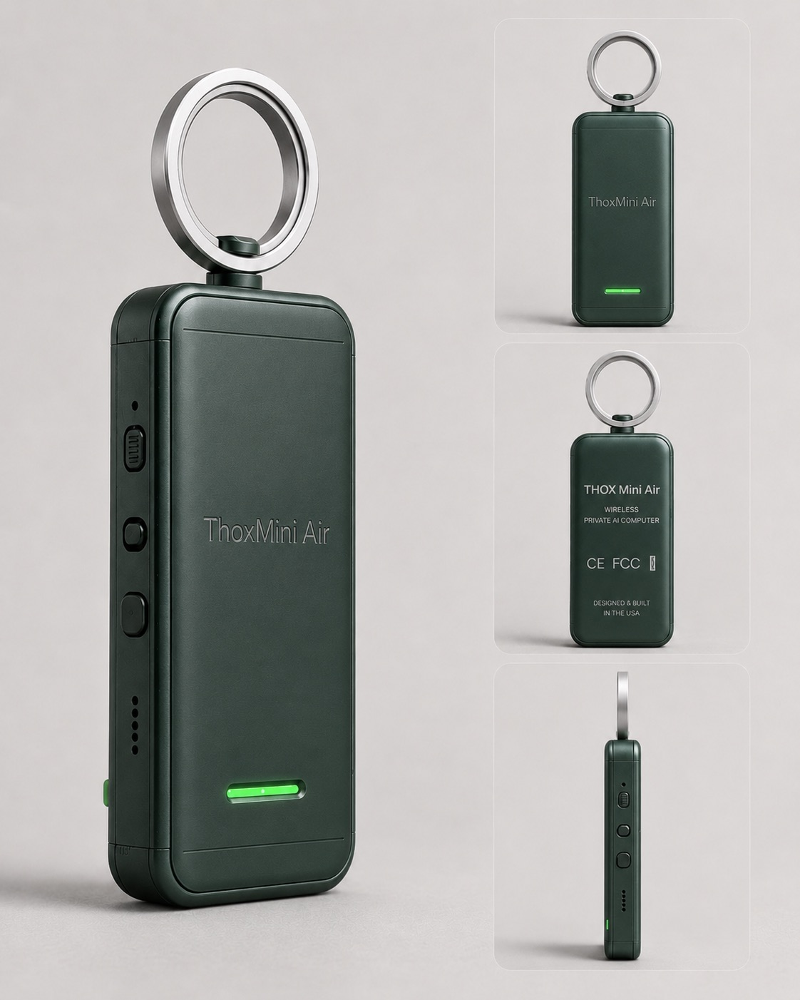

# ThoxMini Air — Spec Sheet (v2)

> Tetherless edge AI cluster node with magnetic stacking. Compute core of ThoxMini + LiPo cell + MagStack ring.

---

## Overview

ThoxMini Air takes the compute core of ThoxMini, adds a small LiPo cell for
tetherless operation, and a magnetic ring on top so each unit clicks neatly
onto the next. A stack of Airs becomes a self-cooled compute cluster you can
carry in one hand.

| Field | Value |
|---|---|
| **Product class** | Tetherless edge compute + cluster node |
| **Target user** | Developer, researcher, cluster builder |
| **Price** | See [Rewards Matrix](../../../docs/REWARDS_MATRIX.md) |
| **Launch** | August 2026 (Kickstarter) |
| **Status** | GO — SoC path shared with ThoxMini; MagStack Air v0.2.0 shipping |

---

## Hardware

| Specification | Value |
|---|---|
| **SoC** | Luckfox Pico Mini B (RV1103) |
| **CPU** | ARM Cortex-A7 @ 1.2 GHz |
| **RAM** | 64 MB DDR2 |
| **Flash** | 128 MB on-board + microSD expansion |
| **NPU** | 0.5 TOPS neural processor |
| **Storage** | microSD / eMMC (pre-flashed at factory) |
| **USB** | 1x USB-C (data + charge) |
| **Power** | 5 V / 1 A via USB-C or internal LiPo cell |
| **Battery** | Liter 602530 500 mAh LiPo (pre-installed, pre-charged) |
| **Battery life** | ~90 minutes typical workload |
| **Magnetic ring** | N52 halo ring for MagStack Cluster Dock stacking |
| **Enclosure** | v4 enclosure, matte black back / light gray halo ring |
| **Dimensions** | ~55 mm × 55 mm × 22 mm (enclosure with ring) |
| **Weight** | ~60 g (including cell) |
| **Operating temp** | 0 °C to 45 °C |
| **Cooling** | Passive + magnetic ring thermal transfer |

---

## Software

| Specification | Value |
|---|---|
| **OS** | THOX OS (Linux-based, embedded) |
| **Agent** | thoxymicro (Go, Apache-2.0) |
| **Runtime** | THOX runtime with 14 ThoxMini skills + cluster-aware skill stub |
| **Default model** | thoxmini-3b Q3_K_S → `ttracx/thoxmini:240steps` |
| **Inference engine** | llama.cpp (MIT) on NPU |
| **Factory registry** | [thoxllm-factory `registry/0.1.6.json`](https://github.com/ttracx/thoxllm-factory/blob/main/registry/0.1.6.json) |
| **Networking** | USB-Ethernet, Tailscale (optional), mDNS |
| **Web UI** | `http://172.32.0.70:18790` (USB) or `http://thoxmini-air.local:18790` (mDNS) |
| **SSH** | `ssh root@172.32.0.70` |
| **Telemetry** | Off by default |
| **Cluster** | MagStack Cluster Dock — 4 to 8 Airs self-discover and load-balance |

---

## In the box

- 1 × ThoxMini Air node in v4 enclosure
- 1 × USB-A to USB-C cable, 1 m
- 1 × quick-start card
- 1 × THOX brand sticker
- 1 × spec card with device serial number
- 1 × Liter 602530 500 mAh LiPo cell (pre-installed and pre-charged)

---

## Cluster mode

Stack 4 to 8 Airs onto a MagStack Cluster Dock:
- Units self-discover via magnetic pogo connectors
- Load-balance inference across the ring
- Bottom-most Air handles power when on a Cluster Dock
- Otherwise each Air uses its own cell

Firmware: [ttracx/magstack-air v0.2.0](https://github.com/ttracx/magstack-air/releases/tag/v0.2.0)

---

## Safety

- LiPo cell is pre-installed — do not pry enclosure open
- Do not charge in an enclosed bag overnight
- N52 magnetic ring: keep 100 mm from credit cards, hard drives, mechanical watches, medical implants
- Not weather-sealed — keep dry

---

## Compliance

- FCC Part 15 Class B (declaration on file)
- CE marking (declaration on file)

---

## Warranty

1-year limited warranty against defects in materials and workmanship.
Email `dev@thox.ai` for claims.

---

## Links

- **User manual**: [`content/manuals/thoxmini-air/MANUAL.md`](../../../content/manuals/thoxmini-air/MANUAL.md)
- **Firmware**: [ttracx/magstack-air](https://github.com/ttracx/magstack-air)
- **SoC**: [ttracx/thoxmini-air-soc](https://github.com/ttracx/thoxmini-air-soc)
- **Models**: [ttracx/thoxllm-factory](https://github.com/ttracx/thoxllm-factory)
- **Support**: `dev@thox.ai` · [docs.thox.ai/thoxmini-air](https://docs.thox.ai/thoxmini-air)

---

*THOX.ai — Tulsa, Oklahoma — Copyright © 2026 THOX.ai LLC.*