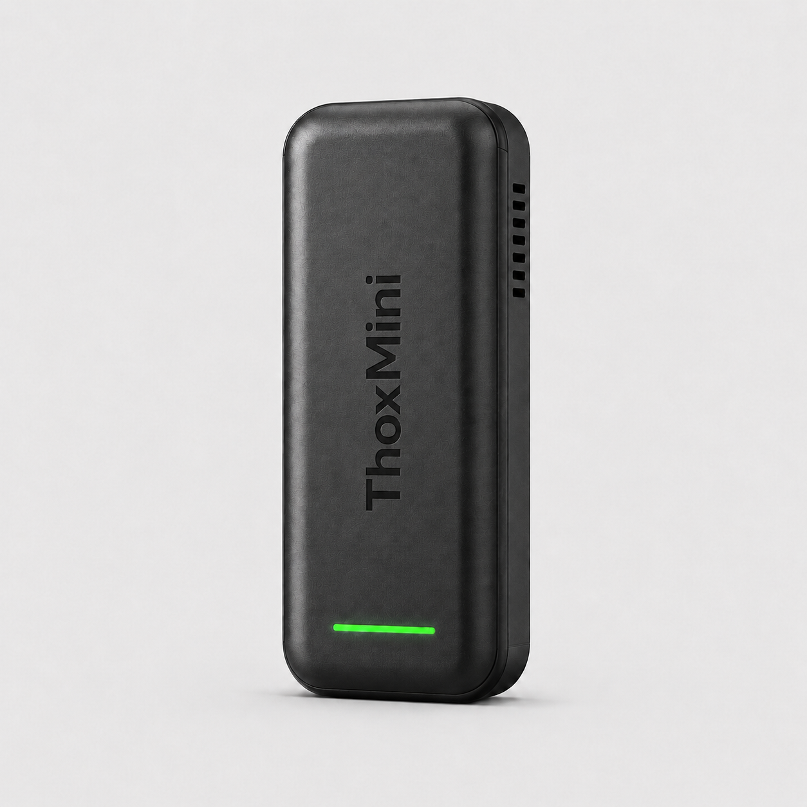

# ThoxMini — Spec Sheet (v2)

> Single-node edge compute. Bench-top private AI agent that runs without internet.

---

## Overview

ThoxMini is the single-node edge compute member of the THOX device fleet.
Inside the brushed-finish enclosure is a Luckfox Pico Mini B board running an
on-device 0.5 TOPS neural processor and the THOX runtime, ready to host private
skills the moment you plug it in.

| Field | Value |
|---|---|
| **Product class** | Single-node edge compute |
| **Target user** | Developer, researcher, bench-top AI user |
| **Price** | See [Rewards Matrix](../../../docs/REWARDS_MATRIX.md) |
| **Launch** | August 2026 (Kickstarter) |
| **Status** | GO — SoC + Go agent both on main; model path ready |

---

## Hardware

| Specification | Value |
|---|---|
| **SoC** | Luckfox Pico Mini B (RV1103) |
| **CPU** | ARM Cortex-A7 @ 1.2 GHz |
| **RAM** | 64 MB DDR2 |
| **Flash** | 128 MB on-board + microSD/eMMC (pre-flashed) |
| **NPU** | 0.5 TOPS neural processor |
| **USB** | 1x USB-C (data + power) |
| **Power** | 5 V / 1 A via USB-C (under 1 A draw) |
| **Enclosure** | THOX brushed-finish enclosure, matte black / arctic white / space gray |
| **Dimensions** | ~55 mm × 55 mm × 20 mm (enclosure) |
| **Weight** | ~45 g (board + enclosure) |
| **Operating temp** | 0 °C to 50 °C (NPU throttles above 50 °C) |
| **Cooling** | Passive (no fan) |

---

## Software

| Specification | Value |
|---|---|
| **OS** | THOX OS (Linux-based, embedded) |
| **Agent** | thoxymicro (Go, Apache-2.0) at `/usr/local/bin` |
| **Runtime** | THOX runtime with 14 pre-installed skills |
| **Default model** | thoxmini-3b Q3_K_S → `ttracx/thoxmini:240steps` |
| **Inference engine** | llama.cpp (MIT) on NPU |
| **Factory registry** | [thoxllm-factory `registry/0.1.6.json`](https://github.com/ttracx/thoxllm-factory/blob/main/registry/0.1.6.json) |
| **Networking** | USB-Ethernet, SSH, Tailscale (optional), mDNS |
| **Web UI** | `http://172.32.0.70:18790` or `http://thoxmini.local:18790` |
| **SSH** | `ssh root@172.32.0.70` |
| **ADB** | `adb devices -l` → `adb shell` (root shell) |
| **Telemetry** | Off by default |

---

## In the box

- 1 × ThoxMini in THOX enclosure
- 1 × USB-A to USB-C cable, 1 m
- 1 × quick-start card
- 1 × THOX brand sticker
- 1 × spec card with device serial number

---

## Skills

14 pre-installed skills: summarize, translate, transcribe, classify, extract,
redact, plan, route, draft, edit, lint, format, archive, sync.

Cluster-capable: add more nodes for MagStack Cluster Dock.

---

## Compliance

- FCC Part 15 Class B (declaration on file)
- CE marking (declaration on file)

---

## Warranty

1-year limited warranty against defects in materials and workmanship.
Email `dev@thox.ai` for claims.

---

## Links

- **User manual**: [`content/manuals/thoxmini/MANUAL.md`](../../../content/manuals/thoxmini/MANUAL.md)
- **Firmware**: [ttracx/thoxymicro](https://github.com/ttracx/thoxymicro)
- **SoC**: [ttracx/thoxmini-soc](https://github.com/ttracx/thoxmini-soc)
- **Models**: [ttracx/thoxllm-factory](https://github.com/ttracx/thoxllm-factory)
- **Support**: `dev@thox.ai` · [docs.thox.ai/thoxmini](https://docs.thox.ai/thoxmini)

---

*THOX.ai — Tulsa, Oklahoma — Copyright © 2026 THOX.ai LLC.*