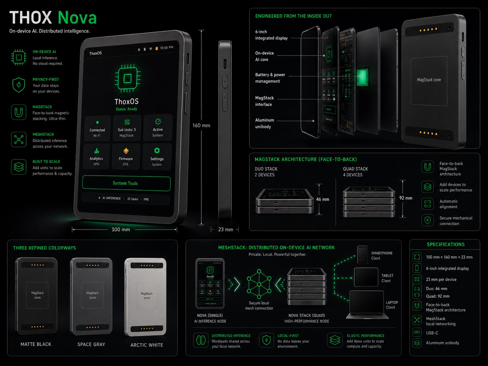

# ThoxNova — Spec Sheet (v2)

> Workstation-class local AI offload target. Desk-class compute for a fleet of THOX devices.

---

## Overview

ThoxNova is the workstation-class compute node in the THOX device fleet.
Inside the chassis is a LattePanda Sigma or Mu N100 single-board computer
running Ubuntu 24.04 LTS, an Intel UHD iGPU with the full SYCL + OpenVINO +
Vulkan compute stack, and the THOX runtime. It is designed to sit on a desk,
on a server shelf, or on the edge of a small lab as the local offload target
for one or more ThoxMini or ThoxClip clients.

| Field | Value |
|---|---|
| **Product class** | Workstation-class edge AI server |
| **Target user** | Lab, small office, fleet operator |
| **Price** | See [Rewards Matrix](../../../docs/REWARDS_MATRIX.md) |
| **Launch** | August 2026 (Kickstarter) |
| **Status** | GO — shipping ready |

---

## Hardware

| Specification | Value |
|---|---|
| **Board** | LattePanda Sigma or Mu N100 SBC |
| **CPU** | Intel N100 (4-core, up to 3.4 GHz) or LattePanda Sigma (Intel Core i3/i5/i7) |
| **RAM** | 8 GB DDR5 (Sigma: up to 64 GB LPDDR5) |
| **Storage** | NVMe M.2 SSD (≥ 64 GB, pre-installed and pre-flashed) |
| **GPU** | Intel UHD iGPU (SYCL + OpenVINO + Vulkan compute stack) |
| **NPU** | Intel NPU (where applicable) |
| **USB** | Multiple USB-A / USB-C ports |
| **Power** | 12 V / 5 A barrel-jack PSU (regional plug included) |
| **Networking** | Gigabit Ethernet, Wi-Fi 6, Bluetooth 5.2 |
| **Enclosure** | THOX chassis, vented rear and underside |
| **Operating temp** | 0 °C to 40 °C ambient |
| **Cooling** | Active (fan) |

---

## Software

| Specification | Value |
|---|---|
| **OS** | Ubuntu 24.04 LTS |
| **Agent** | THOX runtime + thoxymicro agent |
| **Compute stack** | SYCL, OpenVINO, Vulkan, llama.cpp |
| **Default model** | thoxmini-3b or larger (up to 7B-9B with iGPU offload) |
| **Inference engine** | llama.cpp (MIT) + OpenVINO + SYCL |
| **Factory registry** | [thoxllm-factory `registry/0.1.6.json`](https://github.com/ttracx/thoxllm-factory/blob/main/registry/0.1.6.json) |
| **Networking** | Ethernet, Wi-Fi, Tailscale (optional) |
| **Web UI** | `http://thoxnova.local:18790` |
| **SSH** | `ssh root@thoxnova.local` |
| **Telemetry** | Off by default |
| **Fleet role** | Offload target for ThoxMini / ThoxClip / ThoxMini Air clients |

---

## In the box

- 1 × ThoxNova in THOX chassis
- 1 × NVMe M.2 SSD (≥ 64 GB, pre-installed and pre-flashed)
- 1 × 12 V / 5 A barrel-jack power supply with regional plug
- 1 × USB-A to USB-C cable for console rescue (1 m)
- 1 × quick-start card
- 1 × THOX brand sticker
- 1 × spec card with device serial number

---

## Compliance

- FCC Part 15 Class A (declaration on file)
- CE marking (declaration on file)

---

## Warranty

1-year limited warranty against defects in materials and workmanship.
Email `dev@thox.ai` for claims.

---

## Links

- **User manual**: [`content/manuals/thoxnova/MANUAL.md`](../../../content/manuals/thoxnova/MANUAL.md)
- **Firmware**: [ttracx/thoxymicro](https://github.com/ttracx/thoxymicro)
- **Models**: [ttracx/thoxllm-factory](https://github.com/ttracx/thoxllm-factory)
- **Support**: `dev@thox.ai` · [docs.thox.ai/thoxnova](https://docs.thox.ai/thoxnova)

---

*THOX.ai — Tulsa, Oklahoma — Copyright © 2026 THOX.ai LLC.*