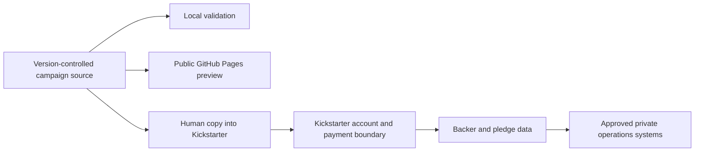

# Security Model

## Scope

This repository is a public-campaign source and preview bundle. It contains copy, public assets, model metadata, operator guidance, and validation scripts. It is not an approved store for credentials, payment records, identity documents, supplier banking data, customer/backer data, private firmware keys, or unreleased vulnerability details.

## Threat model

| Threat | Impact | Control |
|---|---|---|
| Secret or personal-data commit | Credential loss, privacy breach | Placeholder-only `.env.example`, review, secret scanning, and explicit exclusions |
| Misleading privacy/security claim | Backer harm and trust loss | Canonical claim guardrails, tests, founder review, concept-visual labels |
| Compromised GitHub Actions dependency | Repository or Pages supply-chain risk | Minimal workflow permissions and pinned major action versions; periodic action review remains required |
| Malicious campaign content or link | Reviewer redirection or script execution | Static bundle review, local-reference validation, no campaign backend |
| Unauthorized campaign/admin access | Fraudulent edits, launch, or payment changes | THOX-controlled accounts, least privilege, 2FA, private recovery-code custody |
| Backer-data export into Git | PII exposure and retention failure | Keep operational records in approved private systems; never commit exports |
| Generated media presented as real product evidence | Misrepresentation | Explicit concept labels and founder approval before public use |

## Trust boundaries

- Repository and local validation contain public campaign material only.
- GitHub Pages is public and must not receive credentials, private previews, or backer data.
- Kickstarter account access, payment setup, identity verification, and backer data are external sensitive boundaries.
- Optional email, analytics, and pledge-manager integrations are disabled until explicitly configured in an approved private environment.

## Secrets handling

- Keep real values out of `.env.example` and Git history.
- Store credentials and recovery codes in the company-approved password/vault system.
- Grant collaborator access only for the needed task and remove stale access.
- Do not paste tokens into issues, Actions logs, screenshots, demo recordings, or campaign assets.
- Rotate and investigate any secret that is accidentally exposed.

## Authentication and authorization

This repository does not implement end-user authentication. Repository access follows GitHub permissions. Kickstarter and operational accounts must use THOX-controlled identities, least-privilege roles, multi-factor authentication, and private recovery procedures.

## Data retention

- Public campaign source follows repository history and release retention.
- Backer, payment, identity, supplier, and support records must not be retained here.
- Demo footage must be reviewed for notifications, credentials, customer information, and unrelated personal data before retention or publication.

## Encryption

Git and Pages do not provide application-level encryption for repository content; therefore only public-safe material belongs here. Sensitive operational data must use approved encrypted storage and transport outside this repository. This document does not claim implementation evidence for device-storage encryption.

## Audit logging

- Git history records campaign-source changes.
- GitHub Actions records validation and Pages deployment runs.
- `config/launch-readiness.json` records public-safe launch gate state and evidence paths.
- Sensitive account, payment, and backer operations require logs in the approved private operator system, not this repository.

## Local/cloud boundary

Validation, preview serving, and content review work offline. GitHub and Kickstarter are explicit optional/public campaign services, not part of the local THOX product data plane. Campaign materials must not imply that every product workflow is offline when a user explicitly enables a connector.

## Known risks and mitigations

- Superseded campaign trees still contain conflicting dates and product claims. Keep them out of canonical publication paths and complete the reconciliation/archive decision.
- Operator security gates cannot be verified from repository state. Keep `release_ready=false` until private evidence is reviewed.
- Workflow action versions are pinned to major tags rather than immutable SHAs. Review and pin immutable commits before a high-risk release.
- A passing source validator is not physical manufacturing, certification, penetration-test, or legal-compliance evidence.

See `SECURITY.md` for reporting and repository policy.
